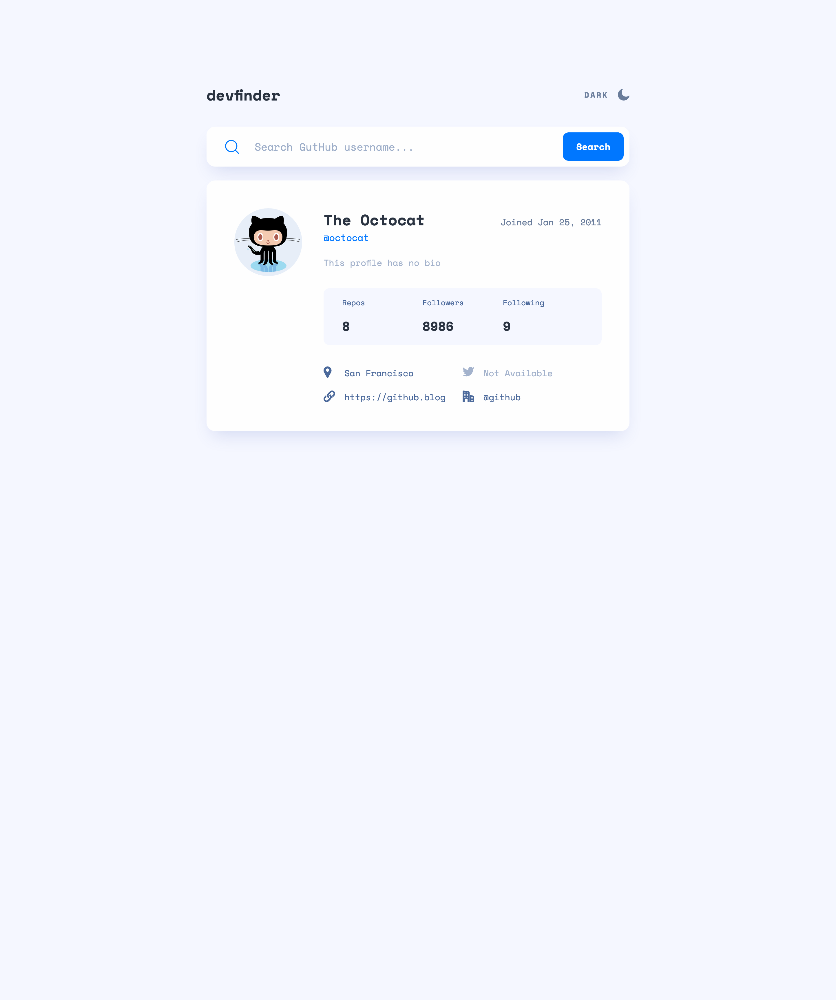

# Frontend Mentor - GitHub user search app solution

This is a solution to the [GitHub user search app challenge on Frontend Mentor](https://www.frontendmentor.io/challenges/github-user-search-app-Q09YOgaH6). Frontend Mentor challenges help you improve your coding skills by building realistic projects. 

## Table of contents

- [Overview](#overview)
  - [The challenge](#the-challenge)
  - [Screenshot](#screenshot)
  - [Links](#links)
- [My process](#my-process)
  - [Built with](#built-with)
  - [What I learned](#what-i-learned)
  - [Continued development](#continued-development)
  - [Useful resources](#useful-resources)
- [Author](#author)
- [Acknowledgments](#acknowledgments)

**Note: Delete this note and update the table of contents based on what sections you keep.**

## Overview

### The challenge

Users should be able to:

- View the optimal layout for the app depending on their device's screen size
- See hover states for all interactive elements on the page
- Search for GitHub users by their username
- See relevant user information based on their search
- Switch between light and dark themes
- **Bonus**: Have the correct color scheme chosen for them based on their computer preferences. _Hint_: Research `prefers-color-scheme` in CSS.

### Screenshot

### Links

- Solution URL: [Add solution URL here](https://github.com/kwonmoon/github-user-search-app)
- Live Site URL: [Add live site URL here](https://splendid-taiyaki-865a48.netlify.app/)

## My process

### Built with

- Semantic HTML5 markup
- CSS custom properties
- Flexbox
- CSS Grid
- Javascrript
- API

### What I learned

It was very fun to learn how to switch the mode based on the user computer's setup as well as the user's selection inside the app.

### Useful resources

- [CSS-TRICKS A Complete Guide to Dark Mode on the Web](https://css-tricks.com/a-complete-guide-to-dark-mode-on-the-web/) - This helped me to understand the general concept of mode changes.

## Author

- Frontend Mentor - [@kwonmoon](https://www.frontendmentor.io/profile/kwonmoon)
- Twitter - [@kevin_moon_0830](https://www.twitter.com/kevin_moon_0830)

